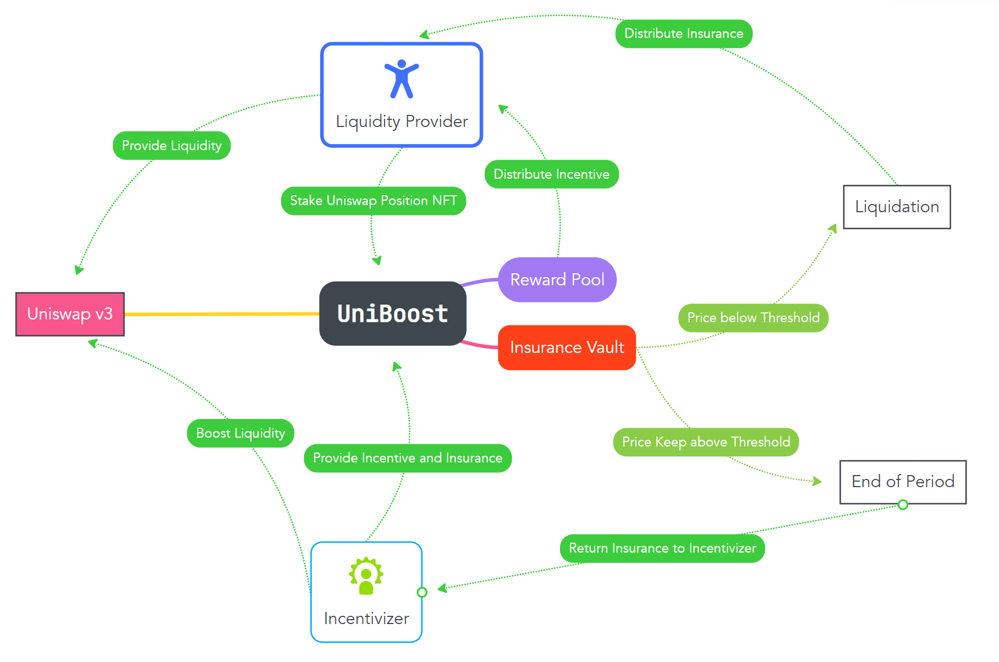
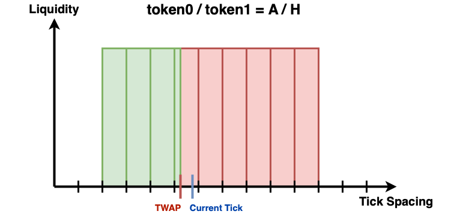

# UniBoost

### [Contract (this repo)](https://github.com/ETH-Taipei-UniBoost/UniBoost) | [Frontend](https://github.com/ETH-Taipei-UniBoost/React-UniBoost) | [Doc](https://github.com/ETH-Taipei-UniBoost/Doc)

### Overview:

A Trustless and Permissionless Liquidity Mining Tool for Uniswap v3

-   Incentivizers enable boosting program, providing rewards and insurance for liquidity providers.
-   Incentivizers aim to boost liquidity of a specific token A,
    paired with a health asset H.
-   Rewards distributed proportionally to trading fee earned by
    token A, ensuring only effective positions are rewarded.
-   If price falls below a certain threshold, anyone can close the boosting program and insurance cab be claimed by liquidity providers.

### System Diagram

  

### Insurance

-   Protects only risk exposures on health assets.
-   Uses TWAP to prevent flash loan attacks.

  

### Using UniBoost as a Liquidity Provider

-   Stake the position NFT into UniBoost corresponding to the
    pool.
-   Claim reward for the position NFT, with a minimum staking
    time required.
-   Trigger the liquidation process if the price meets set conditions.
-   Claim insurance share after project liquidation by interacting
    with the contract.

### Using UniBoost as an Incentivizer

-   enable boosting program for a pool.
-   Add more incentive to the project.
-   Claim remaining incentive and insurance after project
    completion.
